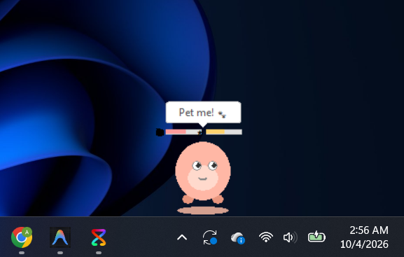
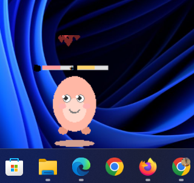
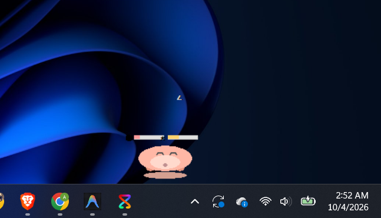
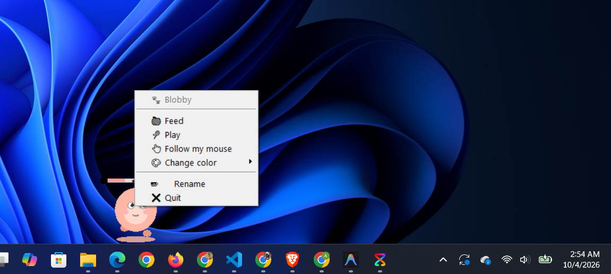

# 🐾 PixelPal

**A tiny desktop pet that lives on top of your screen.**
It walks around, follows your mouse, falls asleep when you ignore it, and gets hungry if you forget about it.


<p align="center">
  
</p>

---

## ✨ Features

- **Transparent, borderless pet**: no window, no background. Only the pet is visible on your desktop, always on top.
- **Walks around** your screen and blinks, with a squash-and-stretch walking animation.
- **Follows your mouse**: it runs after your cursor when you ask it to (or when your cursor stays near it).
- **Pick it up and drop it**: drag the pet, its eyes go wide and its feet dangle. Let go and it falls with gravity and bounces.
- **Click to pet it**: hearts float up and it gets happy.
- **Sleeps** after 60 seconds without interaction (with floating "Zzz") and wakes up when you click it.
- **Hunger and happiness**: both slowly drop over time. Keep your pet happy by feeding and playing with it.
- **Speech bubbles**: it talks to you now and then ("I'm hungry!", "Play with me!").
- **5 colors** to choose from.
- **Remembers everything**: name, color, and mood are saved locally and restored next time you open it.
- **Zero dependencies**: built only with Python's standard library (`tkinter`).

---

## 📸 Screenshots

| Walking | Happy | Sleeping | Menu |
|:---:|:---:|:---:|:---:|
|  |  |  |  |

---

## 📥 Download (easiest)

1. Go to the [**Releases**](../../releases) page.
2. Download `PixelPal.exe` from the latest release.
3. Double-click it. Your pet appears!

> **Windows SmartScreen warning?** Because the app is a small unsigned `.exe`, Windows may show *"Windows protected your PC"*. Click **More info → Run anyway**. The full source code is in this repository, so you can read exactly what it does.

---

## 🎮 How to play

| Action | What happens |
|---|---|
| **Left-click** the pet | It gets happy, hearts float up |
| **Click and drag** | Picks the pet up; release to drop it |
| **Right-click** | Opens the menu: *Feed*, *Play*, *Follow my mouse*, *Change color*, *Quit* |
| **Do nothing for 60 s** | The pet falls asleep 💤 |
| **Click a sleeping pet** | Wakes it up |

---

## 🛠️ Run from source

Requirements: **Windows** and **Python 3.8+** (`tkinter` comes with the standard Python installer).

```bash
git clone https://github.com/AroobaHanif/PixelPal.git
cd PixelPal
python pixelpal.py
```

No `pip install` needed.

### Build your own `.exe`

```bash
pip install pyinstaller
pyinstaller --onefile --noconsole --name PixelPal --icon icon.ico --add-data "icon.ico;." pixelpal.py
```

The executable will be created in the `dist/` folder.

---

## 🧠 How it works

The pet is a small **state machine** with these states:

`IDLE` · `WALK` · `FOLLOW` · `SLEEP` · `DRAGGED` · `FALL` · `HAPPY`

- The window is made transparent with `overrideredirect(True)` and `-transparentcolor`, so only the drawn pet shows up.
- The pet is drawn entirely with `tkinter.Canvas` shapes (no image files).
- Animation runs on `after()` timers; the cursor is tracked with `winfo_pointerxy()`.
- Pet data (name, color, mood) is stored in a small JSON file on your computer.

---

## 📁 Project structure

```
PixelPal/
├── pixelpal.py        # the whole app (class PixelPalApp)
├── icon.ico           # app icon
├── assets/            # screenshots and demo GIF
├── requirements.txt   # no external dependencies
├── LICENSE            # MIT
└── README.md
```

---

## 🗺️ Ideas for the future

- More pet characters and accessories
- Sound effects
- Mini-games to play with the pet
- macOS / Linux support

---

## 📄 License

Released under the [MIT License](LICENSE).

---

Made with ❤️ and Python by [Arooba Hanif](https://github.com/AroobaHanif)

If you like PixelPal, give it a ⭐ on GitHub!
